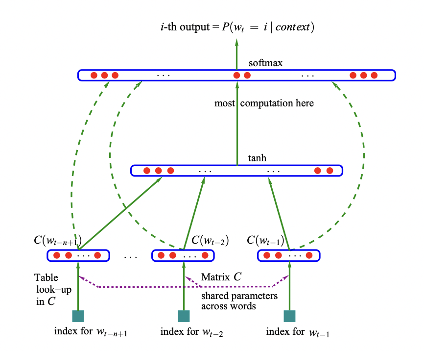

# Multilayer perceptron (MLP) language model

### Network architecture

https://www.jmlr.org/papers/volume3/bengio03a/bengio03a.pdf



### Generate names

Generate random boy names by creating a MLP language model trained on 1000 names.

Run this to create a model and generate up to 100 names in terminal:

```bash
python generate_names.py
```

Model exploration is shown in notebook folder.

### Setup environment

All content in this folder can be executed within this virtual environment

1.
```bash
conda create --name lm_mlp python=3.10
```
2.
```bash
conda activate lm_mlp
```
3.
```bash
pip install -r requirements.txt
```

### Other data

Just add a new text file under data folder and change path in python file.
